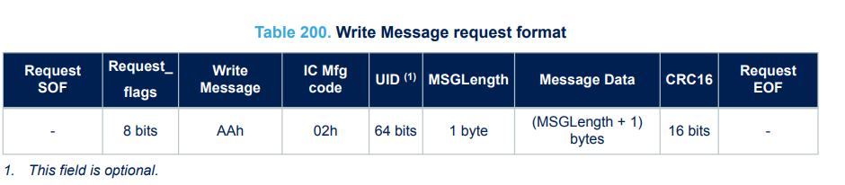

# Magic Epaper Firmware

**Magic Epaper Firmware** is a customizable and efficient firmware designed to control FOSSASIA's epaper displays. This project is ideal for applications such as smart signage, dashboards, IoT devices, and more, providing a seamless interface for rendering content on e-ink screens.

## Features

- **Optimized for the FOSSSASIA epaper Display**: Smooth rendering with minimal power consumption.
- **Modular Codebase**: Easy to customize for different e-paper display sizes and types.
- **Low-Power Operations**: Designed for battery-powered devices.
- **Flexible Connectivity**:
  - Supports communication over SPI, I2C, or UART.
  - Compatible with the following microcontroller
- **Rich Content Rendering**:
  - Text, images, and custom graphics.
  - Support for grayscale and partial refresh (depending on the display).
- **Open Source**: Fully open-source firmware under the Apache2 license.

## Supported Displays

The firmware currently supports the following e-ink displays:
- FOSSASIA e-paper display.
- Generic SPI-based e-ink displays.

For other displays, you can add support by modifying the display driver module.

## Usages

This firmware was designed as a bridge between the NFC reader and the epaper
display. All commands from the epaper display are exposed to the NFC reader via
NFC-V's (iso15693) `Write Message` command (see table below from ST25DV
datasheet).



Every message sent from the reader is encapsulated. Its length might vary but is
always less than 256 bytes.

The first byte is the command byte for the firmware. It instructs the firmware
on how the chip should act. Available commands are:

- Forwarding EPD command: `0x00`
- Forwarding EPD Data: `0x01`

Forwarding EPD command: this command pulls down the C/D pin of the epaper
display, and forwards the next byte. This next byte is the command of the
display driver chip. If more bytes follow after this next byte, these following
bytes will be forwarded as parameters for the corresponding command of the
display driver chip, and the C/D pin will be pulled up. Please refer to the
driver chip's datasheet/manual (e.g., [UC8253's
datasheet](https://www.good-display.com/companyfile/794.html)) of the display
for the details of EPD's Command and its param.

Forwarding EPD Data: This command pulls up the C/D pin of the epaper display,
and forwards all the remaining bytes to the epaper display over SPI. It is
useful when sending a big fat message block (larger than the iso15693's message
length). The big fat message should be split into chunks and then sent by this
Forwarding EPD Data command.

Before starting to transfer, the reader must turn on energy harvesting for the
tag using the `Write Dynamic Configuration` command (cmd code AEh) @02h.

The reader should check if the MCU has read the previous chunk before writing
another chunk by checking if the `RF_PUT_MSG` bit has been cleared using the
`Read Dynamic Configuration` command (cmd code ADh) @0Dh.

For the details of other ISO15693 commands that are supported and extended by
ST25DV, please refer to [ST25DV's
datasheet](https://www.st.com/resource/en/datasheet/st25dv04kc.pdf).

## Development

### Tools

- [GNU make](https://www.gnu.org/software/make/)
- [MounRiver Toolchain](http://file-oss.mounriver.com/tools/MRS_Toolchain_Linux_x64_V1.91.tar.xz)
- [wlink](https://github.com/ch32-rs/wlink)
- WCH-linkE

### Building

Set the toolchain location, e.g.:

```sh
export PREFIX=../MRS_Toolchain_Linux_x64_V1.91/RISC-V_Embedded_GCC/bin/riscv-none-embed-
```

Simply run `make` to build the firmware.

### Flashing

After connecting WCH-linkE to the MCU, run `make wlink` to flash the firmware.

## License

This project is licensed under the Apache2 License. See the [LICENSE](LICENSE.md) file for details.
